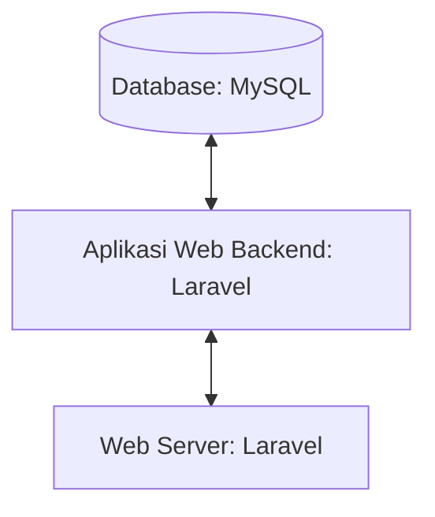

## 1.1 Latar Belakang

DioPharma adalah platform daring yang memungkinkan pengguna untuk menjelajahi, memilih, bertanya dan membeli berbagai jenis obat obatan beserta resep dokter. Pengguna dapat mencari produk obat obatan dan bertanya tentang obat obatan. Aplikasi ini dirancang agar mempermudah jual beli obat di farmasi.

## 1.2. Deksripsi Teknologi Informasi

DioPharma menyediakan pengalaman membeli obet yang mudah, praktis, dan berkualitas tinggi dengan resep dokter. Mempermudah pembelian obat terutama di kalangan mahasiswa yang hidup dirantau sendiri.

## 1.3. Branding

Merk : DioPharma

Tagline : "Healthy patients, we are happy"

Campaign : Membuat Aplikasi sederhana dimana penggunanya dapat cepat sehat dan bahagia .

Target user :
- Orang yang sakit
- Pasien yang membutuhkan obat penting dan segera
- Mereka yang mencari cara praktis untuk membeli obat tanpa keluar rumah
- Orang yang bingung tentang obat obatan 

User experience theme:
- Sederhana
- Kenyamanan
- Warna : Bernuansa Ceria tidak membosankan

   

## 2. User Story

sebagai | saya ingin bisa | sehingga | prioritas
---|---|---|---
Admin | Mengelola data pengguna | Bisa update data pengguna dan menghapus data pengguna | ⭐⭐⭐⭐⭐
Admin | Upload Product | Banyak product yang bisa dipilih user  | ⭐⭐⭐⭐⭐
Admin | Edit Product | Bisa merubah harga, deskripsi, nama product | ⭐⭐⭐⭐⭐
Admin | Hapus Product | Bisa menghapus product | ⭐⭐⭐⭐⭐
Admin | Mengelola Sistem Keamanan | Bisa menjaga integritas dan kerahasiaan data pelanggan | ⭐⭐⭐⭐⭐
Admin | Mengelola Produk | Bisa memastikan katalog selalu terbaru dan sesuai | ⭐⭐⭐⭐⭐
Admin | Mengelola Stok Produk |  Dapat menghindari penjualan produk yang sudah habis stok | ⭐⭐⭐⭐
Admin | Mengelola Pesanan Pelanggan | Bisa memberikan pelayanan yang responsif dan memenuhi kebutuhan pelanggan | ⭐⭐⭐⭐⭐
Admin | Mengelola Metode Pembayaran | Bisa memberikan beragam opsi pembayaran kepada pelanggan | ⭐⭐⭐⭐
Admin | Mengelola Pesan dan Notifikasi Pelanggan | Bisa memberikan informasi yang relevan dan penting kepada pelanggan | ⭐⭐⭐⭐⭐
Admin | Mengelola jasa pengiriman | Bisa memantau kinerja dan hubungan dengan masing-masing mitra pengiriman | ⭐⭐⭐⭐⭐
Pengguna | Menjelajahi produk obat obatan | Dapat menemukan obat yang sesuai dengan enyakit | ⭐⭐⭐⭐
Pengguna | Melihat semua product | Mendapatkan banyak pilihan obat  | ⭐⭐⭐⭐
Pengguna | Memastikan Keamanan Data Pelanggan | Bisa merasa aman berbelanja di website tersebut | ⭐⭐⭐⭐⭐
Pengguna | Bertanya pada Dokter | Bisa bertanya kepada dokter obat apa yang harus di gunakan | ⭐⭐⭐⭐
Pengguna | Menambahkan Item ke Keranjang Belanja | Dapat meninjau dan membelinya nanti. | ⭐⭐⭐⭐
Pengguna | Memilih Metode Pembayaran | Bisa memelih metode untuk pembayaran obat | ⭐⭐⭐⭐⭐
Pengguna | Mengetahui Ketersediaan Stok | Dapat menghindari pesanan yang harus menunggu lama. | ⭐⭐⭐
Pengguna | Menerima Notifikasi Pembayaran dan Pengiriman |  Dapat merasa yakin bahwa pesanan saya sedang diproses dengan benar | ⭐⭐⭐⭐

## 3. Struktur Data

## 4. Arsitektur Sistem

## 5. Teknologi, Library, dan Framework

- UI/UX Design : Canva
- Web Server   : Apache
- Text Editor  : VS Code
- Library      : 
- Framework    : 
- Database     : MySQL

1. **UI/UX Design: Canva**
   - **Pengertian:** UI (User Interface) adalah Design tampilan produk yang visible atau bisa dilihat oleh mata, lebih fokus pada visualisasi, coloring, dan hal-hal yang berkaitan dengan kreativitas dari interface yang akan digunakan oleh pengguna. UX (User Experience) lebih berfokus pada proses pembuatan produk hingga mampu mendapatkan pengalaman kemudahan dari pengguna
   - **Peran:** Canva adalah aplikasi desain grafis yang digunakan untuk membuat grafis media sosial, presentasi, poster, dokumen dan konten visual lainnya. Desainer menggunakan Canva untuk membuat prototipe, menggambarkan tata letak, dan memvisualisasikan pengalaman pengguna.

2. **Web Server: Apache**
   - **Pengertian:** Web server adalah sebuah software (perangkat lunak) yang memberikan layanan berupa data, Berfungsi untuk menerima permintaan HTTP atau HTTPS dari klien atau kita kenal dengan web browser (Chrome, Firefox). 
   - **Peran:** Apache adalah software web server yang digunakan gratis serta open source memungkinkan user upload di internet dan berfungsi untuk membuat koneksi antara server dan browser milik visitor dan Gmengirim file untuk klien server.

3. **Text Editor: VS Code**
   - **Pengertian:** Text editor adalah perangkat lunak untuk menulis dan mengedit kode. VS Code (Visual Studio Code) adalah text editor yang ringan dan kuat, dikembangkan oleh Microsoft.
   - **Peran:** Pengembang menggunakan VS Code untuk menulis, mengedit, dan mengelola kode. Fitur-fitur seperti highlighting sintaksis, saran kode, dan ekstensi membuatnya menjadi pilihan populer di kalangan pengembang.

4. **Library: **
   - **Pengertian:** Library adalah kumpulan modul atau fungsi-fungsi yang dapat digunakan untuk mempercepat pengembangan perangkat lunak. Laravel Jetstream adalah library yang menyediakan fitur-fitur umum untuk aplikasi web, seperti otentikasi pengguna, manajemen sesi, dan panel kontrol.
   - **Peran:** 

5. **Framework: **
   - **Pengertian:** Framework adalah kerangka kerja pengembangan perangkat lunak yang menyediakan aturan, konvensi, dan alat untuk mempercepat pembangunan aplikasi. Laravel adalah framework PHP yang populer untuk pengembangan web.
   - **Peran:** 

6. **Database: MySQL**
   - **Pengertian:** Database adalah kumpulan data yang terorganisir, yang umumnya disimpan dan diakses secara elektronik dari suatu sistem komputer.
   - **Peran:** MySQL sebuah perangkat lunak sistem manajemen basis data SQL atau DBMS yang multialur, multipengguna, dengan sekitar 6 juta instalasi di seluruh dunia.
  

## 6. Desain User Experience dan User Interface

## 7. Demonstrasi Video

Vidio ⬇️⬇️

https://youtu.be/botXZ6Bc_rA?si=94iAf2bqaf_rZVzi

## 8. Bagaimana mesin komputasi dan sistem operasi berperan dalam produk teknologi informasimu ?

Mesin komputasi dan sistem operasi berperan penting dalam produk teknologi informasi. 

1. Mesin Komputasi:
Mesin komputasi adalah  perangkat elektronik yang dirancang untuk menjalankan tugas komputasi yang mencakup perangkat keras (hardware) dan perangkat lunak (software) yang bekerja bersama untuk memproses informasi. Mesin komputasi dapat melakukan operasi aritmetika, penyimpanan data, dan eksekusi perintah berdasarkan program yang dijalankan. 

2. Sistem Operasi:
Sistem operasi adalah perangkat lunak yang mengelola perangkat keras dan menyediakan layanan-layanan dasar bagi perangkat lunak aplikasi dan bertindak sebagai perantara antara pengguna dan perangkat keras, mengoordinasikan akses ke memori, perangkat input/output, dan fungsi-fungsi sistem lainnya. Sistem Operasi juga memanajemen file, keamanan, dan multitasking, memungkinkan beberapa program berjalan secara bersamaan. Contoh sistem operasi meliputi Windows, Linux, dan Android.

Jadi, mesin komputasi dan sistem operasi adalah fondasi yang sangat penting dalam produk teknologi informasi, memungkinkan pengembangan, instalasi, dan penggunaan berbagai aplikasi dan layanan.

## 9. Bagaimana algoritma, struktur data, dan bahasa pemrograman berperan dalam produk teknologi informasimu ?

1. **Algoritma:**
   - **Definisi:** Algoritma adalah langkah-langkah yang digunakan untuk menyelesaikan suatu masalah dan serangkaian instruksi atau aturan yang didefinisikan dengan jelas untuk menyelesaikan suatu permasalahan atau mencapai tujuan tertentu.
   - **Peran:** Algoritma berperan sebagai penyelesaian masalah pemrosesan data, meningkatkan kinerja suatu program, membantu komputer mengolah informasi dan menghasilkan keputusan atau rekomendasi.
   
2. **Struktur Data:**
   - **Definisi:** Struktur data adalah cara mengorganisasi dan menyimpan data di dalam komputer sehingga dapat diakses dengan efisien dengan melibatkan pemilihan dan implementasi metode penyimpanan yang tepat agar operasi-operasi pada data dapat dilakukan dengan cepat dan efektif.
   - **Peran:** Struktur data berperan untuk meningkatkan efisiensi operasional, membantu mengoptimalkan penggunaan memori, menyederhanakan proses pemrosesan data, membantu dalam memodelkan masalah secara lebih efektif

3. **Bahasa Pemrograman:**
   - **Definisi:** Bahasa pemrograman adalah instruksi yang digunakan untuk menulis program komputer yang memungkinkan programmer mengkomunikasikan perintah kepada komputer.
   - **Peran:** Bahasa pemrograman memungkinkan programmer menyusun serangkaian instruksi untuk dijalankan oleh komputer, membuat program komputer yang dapat menjalankan tugas tertentu, mengembangankan aplikasi.

Singkatnya, algoritma langkah-langkah pemecahan masalah, struktur data untuk menyimpan data didalam komputer dan bahasa pemrograman adalah intruksi yang digunakan programmer berkomunikasi dengan komputer . Keseluruhan, kombinasi ketiganya memainkan peran penting dalam pengembangan produk teknologi informasi yang efisien, cepat, dan dapat diandalkan.

## 10. Bagaimana metode pengembangan perangkat lunak / Software Development Life Cycle berperan dalam produk teknologi informasimu ?

**Proses Pembangunan Teknologi Informasi: Web Development Life Cycle**

**Perencanaan yang Sistematis**: SDLC membantu dalam perencanaan tahapan pengembangan, memastikan sumber daya dan waktu yang cukup dialokasikan untuk setiap langkah, sehingga proyek dapat berjalan dengan efisien.

**Pemahaman Kebutuhan Pengguna**: Melalui tahap analisis kebutuhan, SDLC membantu memahami kebutuhan pengguna dengan baik, memastikan bahwa produk yang dihasilkan sesuai dengan ekspektasi pengguna.

**Pengelolaan Risiko**: SDLC membantu dalam mengidentifikasi dan mengelola risiko potensial, sehingga masalah dapat diatasi sejak awal dan tidak mempengaruhi hasil akhir.

**Kontrol Kualitas**: Dengan tahapan pengujian yang terstruktur, SDLC membantu memastikan kualitas produk, mengurangi kesalahan atau bug yang dapat muncul di tahap akhir.

**Pemeliharaan dan Pembaruan**: SDLC memungkinkan pemeliharaan yang efisien dan pembaruan produk seiring waktu, menjaga relevansi dan kehandalan produk.

Penggunaan SDLC dengan baik dapat memberikan manfaat yang signifikan dalam mencapai tujuan pengembangan perangkat lunak dan meningkatkan kualitas serta kinerja produk teknologi informasi.

## 11. Bagaimana database / sistem basis data berperan dalam produk teknologi informasimu ?

Sebuah database adalah kumpulan data yang tersimpan dalam sistem yang terstruktur, dirancang untuk pengelolaan dan akses data yang efisien. Ini berfungsi sebagai penyimpanan terorganisir yang memungkinkan Anda untuk menyimpan, mengakses, dan mengelola informasi dengan cara yang terstruktur dan mudah diakses."

Sebagai contoh saya akan menjelas kan rancangan database yang saya buat
